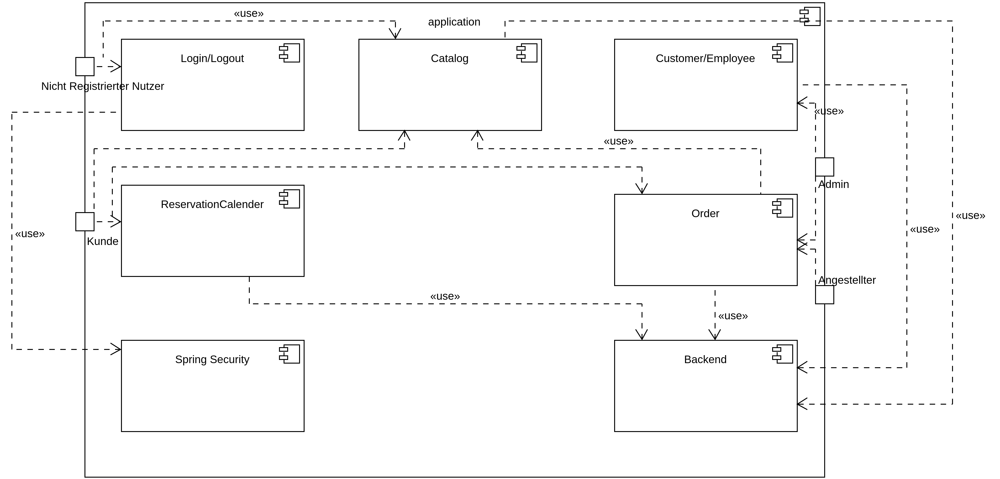
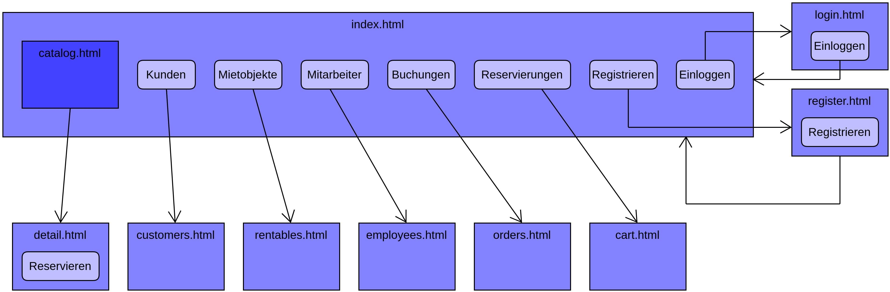

[options="header"]
[cols="1, 3, 3"]
|===
|Version | Bearbeitungsdatum   | Autor 
|1.0	| 09.05.2021 | Gruppe 2
|===

== Entwicklerdokumentation

== Einführung und Ziele

* Aufgabenstellung +
Der Campingplatz Below-The-Sun hat uns beauftragt eine Website zu erstellen, die die Verwaltung des Campingplatzes inklusive aller anfallender Aufgaben wie z.B. Buchungen und Rechnungen erstellen oder der Eingabe von Zusatzequipment übernehmen kann. Dies soll von Mitarbeitern bzw. dem Betreiber vorgenommen werden können. Einzelne Details wie Gruppenrabatte oder die Suche nach ausgewählten Campingplätzen soll auch möglich sein. Außerdem soll die Website die Möglichkeit haben von Kunden im Internet erreichbar zu sein, damit diese sich registrieren und einen Platz reservieren können. +

* Qualitätsziele +
Wartungsfreundlichkeit, + 
Nutzerfreundlichkeit, +
Sicherheit +

1 = Nicht wichtig ..
5 = Sehr Wichtig
[options="header", cols="3h, ^1, ^1, ^1, ^1, ^1"]
|===
|Qualitätsziele           | 1 | 2 | 3 | 4 | 5
|Wartungsfreundlichkeit          |   |   |   | x |
|Nutzerfreundlichkeit                |   |   | x |   |
|Sicherheit                 |   |   |   | x |
|===

== Randbedingungen 

Hardware-Vorgaben
Eine Liste von nötiger Hardware, um das Programm ausführen zu können. +

* Server (_Betriebssystemunabhängig_) +

* Computer (_Betriebssystemunabhängig_) +

* Tastatur +

* Maus +

Software-Vorgaben
Eine Liste von nötiger Software, um das Programm ausführen zu können. +

* Java 11 (_oder neuer_)

Vorgaben zum Betrieb der Software +
Ein Webbrowser mit stabiler Internetanbindung ist nötig um mit dem Programm interagieren zu können. Beispiele hierfür sind mindestens: +

* Internet Explorer / Edge 10.0 +

* Firefox 4.0 +

* Google Chrome 4.0 +

* Opera 9.6

== Kontextabgrenzung

[[context_diagram]]
image::./images/KontextDiagramm.png[Kontext Diagramm, 100%, 100%, pdfwidth=100%, title= "Kontextdiagramm", align=center]

== Lösungsstrategie
=== Erfüllung der Qualitätsziele
 
[options="header"]
|=== 
|Qualitätsziel |Lösung
|Wartungsfreundlichkeit a|
* *Erweiterbarkeit* Die Anwendung besteht aus gesonderten Komponenten, sodass Änderungen weniger Auswirkungen auf andere Komponenten haben.
* *Wiederverwendbarkeit* Sicherstellen, dass Komponenten des System bei anderen wiederverwendet werden können.
* *Anpassbarkeit* Sicherstellen, dass die Anwendung angepasst oder erweitert werden kann ohne, dass Fehler auftreten oder die Qualität gemindert wird.
|Nutzerfreundlichkeit a|
* *Anwendbarkeit* Sicherstellen, dass das System einfach von seinen Nutzern verstanden und genutzt werden kann. Dies kann unter Anderem durch den Einsatz von Beschriftungen und Tooltips, welche geforderte Eingaben eindeutig beschreiben, erreicht werden.
* *Schutz des Nutzers / Fehlerbehandlung* Den Nutzer davor bewahren Fehler zu machen. Falsche Eingaben dürfen nicht zu fehlerhaften Systemstatus führen.
* *UI Erscheinungsbild* Es soll ein angenehmes und befriedigendes Nutzererlebnis bereitgestellt werden. 
* *Zugänglichkeit* Sicherstellen, dass verschiedenste Menschen das System vollständig nutzen können. Dies kann durch bspw. entsprechende Schriftgrößen und Farbkontraste erreicht werden.
|Sicherheit a|
* *Vertraulichkeit* Sicherstellen, dass Daten nur authorisierten Personen zugänglich sind. Dies kann durch den Einsatz von _Spring Security_ und _Thymeleaf_ (`sec:authorize`) erreicht werden.
* *Integrität* Unauthorisierte Änderungen von Daten verhindern. Dies kann durch _Spring Security_ (`@PreAuthorize`) erreicht werden.
* *Verantwortlichkeit* Eindeutige nachverfolgbarkeit von Aktionen oder Ereignissen zu einer Entität oder Person. Um dies zu erreichen soll jeder Vorgang mit einem "Kunden" verknüpft sein.
|===

=== Softwarearchitektur
* Beschreibung der Architektur anhand der Top-Level-Architektur oder eines Client-Server-Diagramms

[[TopLevel]]

[[ClientServer]]

=== Entwurfsentscheidungen
==== Verwendete Muster

* Spring MVC

==== Persistenz
Die Anwendung nutzt *Hibernate annotation based mapping* um Java Klassen auf Datenbanken abzubilden. Als Datenbank kommt *H2* zum Einsatz.

==== Benutzeroberfläche
[[context_diagram]]

==== Verwendung externer Frameworks

[options="header"]
|===
|Externes Paket |Genutzt von (Anwendungsklasse)
|salespointframework.catalog a|
* catalog.CampingSite
* catalog.SiteCatalog
* order.OrderController 
|salespointframework.core a|
* catalog.CatalogInitializer
* customer.CustomerDataInitializer
* inventory.InventoryInitializer
|salespointframework.inventory a|
* catalog.CatalogController
* inventory.InventoryController
* inventory.InventoryInitializer
|salespointframework.order | order.OrderController
|salespointframework.quantity a|
* catalog.CatalogController
* inventory.InventoryInitializer
* order.OrderController
|salespointframework.SalespointSecurityConfiguration |campingplatz.WebSecurityConfiguration
|salespointframework.time | catalog.CatalogController
|salespointframework.useraccount a|
* customer.Customer
* customer.CustomerDataInitializer
* customer.CustomerManagement
* order.OrderController
|springframework.boot |campingplatz.CampingPlatz
|springframework.data a|
* catalog.SiteCatalog
* customer.CustomerManagement
* customer.CustomerRepository
|springframework.security | campingplatz.WebSecurityConfiguration
|springframework.ui a|
* catalog.CatalogController
* customer.CustomerController
* inventory.InventoryController
* order.OrderController
|springframework.util a|
* customer.CustomerController
* customer.CustomerDataInitializer
* order.OrderController
|springframework.validation |customer.CustomerController
|springframework.web |campingplatz.CampingSiteWebConfiguration
|===

==== Bausteinsicht
* Entwurfsklassendiagramme der einzelnen Packages

=== Catalog

[options="header"]
|=== 
|Class/Enumeration |Beschreibung
|CampSiteController |Ein Spring Controller, der dazu dient ``Campingplätze`` zu erschaffen
|CampSiteInitializer |Eine implementierung des DataInitializer aus Spring um Dummy``Campingplätze`` (in diesem Fall die vom Kunden gekauften Plätze) direkt bei Systemstart zu initialisieren.
|CampSiteManagement | Ein Verwaltungssystem der Einzel``Campingplätze`` und Ihrer Bestandteile
|Campsite |Eine Klasse welche die ``Campingplätze`` und ihre Eigenschaften beschreibt
|PriceGroup |Eine Klasse welche die Preisgruppe der ``Campingplätze`` beschreibt
|CampSiteCatalog |Eine Erweiterung des Salespoint.Catalog um Camplingplatz spezifische Anfragen zu erzeugen
|===

=== Booking

[options="header"]
|=== 
|Class/Enumeration |Beschreibung
|===

=== Extras

[options="header"]
|=== 
|Class/Enumeration |Beschreibung
|===

=== Customer
 

[options="header"]
|=== 
|Class/Enumeration |Beschreibung
|===

== Laufzeitsicht
=== Catalog

[[runtime_view]]

== Technische Schulden
=== Quality Gates
_Hinweis: In diesem Abschnitt werden alle fehlgeschlagenen Quality Gates aufgelistet. Diese Bewertungen reichen von *A* (am besten) bis *E* (am schlechtesten)._
[options="header"] 
|===
| Quality Gates | Istwert | Ziel 
| _X_ | _X_ | _X_
|===

=== Probleme
_Hinweis: In diesem Abschnitt werden alle SonarQube-Probleme mit den Prioritäten *Blocker*, *Kritisch* und *Major* sowie häufig auftretende *Minor*-Probleme aufgelistet_
[options="header"]
[options="header", cols="1, 2, 2, 2"]
|===
| Priorität | Beschreibung | Standort | Entsprechendes Qualitätstor 
| _X_ | _X_ | _X_ | _X_
|===