= Pflichtenheft
:project_name: Campingplatzverwaltung
{project_name}

[options="header"]
[cols="1, 1, 1, 1, 4"]
|===
|Version | Status      | Bearbeitungsdatum   | Autoren(en) |  Vermerk  
|0.1     | In Arbeit   | 10.04.2021          | - Johannes Holzhauer
- Kevin Schimpf
- Timo Bundt
- Florian Müller
- Jakob Dunkel
- Boleslav Glavatki      | Initialversion
|1.0     | Final   | 05.07.2021          | 
- Johannes Holzhauer
- Kevin Schimpf
- Timo Bundt
- Florian Müller
- Jakob Dunkel
- Boleslav Glavatki      | 

Alle Kannkriterien wurden Erfüllt
|===

== Inhaltsverzeichnis

|=== 
|**<<Zusammenfassung>>**  
|**<<Aufgabenstellung>>**   
|**<<Produktnutzung>>**     
|**<<Interessensgruppen>>** 
|**<<Systemgrenze>>** 
|**<<Akteure>>**      
|**<<Anwendungsfallbeschreibungen>>**  
|**<<Funktionale>>** 
|**<<Nicht-Funktionale>>** 
|**<<GUI>>** 
|**<<Akzeptanztestfälle>>** 
|**<<Glossar>>**  
|===

[[Zusammenfassung]]
== Zusammenfassung
In diesem Dokument wird der Lösungsansatz für die durch den Auftraggeber geforderten Spezifikationen definiert. Im Gegensatz zu dem Lastenheft werden im Folgenden die Lösungsansätze detailliert beschrieben und es wird tiefergehend auf den jeweiligen Lösungsansatz eingegangen. Durch den Auftragnehmer wird beschrieben, wie und womit ein jeweiliges Problem gelöst wird. Das Dokument ist versioniert und ist rechtlich bindend. Ziel dieses Dokumentes soll es sein, dem Auftraggeber programminterne Verfahren näherzubringen und es diesem zu ermöglichen, auch bei Fachfremdheit einen Überblick über die verwendeten Verfahren und Prinzipien gewinnen zu können.

[[Aufgabenstellung]]
== Aufgabenstellung und Zielsetzung
Der Besitzer des Campingplatzes Below-The-Sun hat Sie damit beauftragt, eine Verwaltungssoftware zu entwickeln. Der Platz ist aufgrund seiner guten Lage stark frequentiert, so daß die derzeit noch vorherrschende Papierbuchhaltung zu viel Zeit kostet. Auf dem Campingplatz werden verschiedene Dienste angeboten, deren gesamte Abwicklung das Programm unterstützen soll.
Das wichtigste dabei ist natürlich die Verwaltung/Vergabe der Stellplätze. Below-The-Sun hat eine gewisse Anzahl von verschieden dimensionierten Zelt- und Lagerplätzen. An einigen ist direkt ein Parkplatz für Auto, Motorrad oder Campingwagen angegliedert. Alle Kombinationen sind hier denkbar. Eine telefonische und Online-Vorreservierung der Plätze soll möglich sein, die Reservierungen werden aber am Morgen nach dem geplanten Anreisetermin gelöscht und der Platz steht anderen Campern wieder zur Verfügung. Jeder Kunde wird bei seiner Ankunft registriert und erhält den gewünschten Platz automatisch zugewiesen. Sollte kein den Anforderungen des Kunden entsprechender Stellplatz mehr vorhanden sein, so muß der Betreiber nach einer möglichst passenden Alternative suchen können. Eventuell kann der Camper sein Auto beispielsweise auf einem anderen Parkplatz abstellen oder ist mit einem kleineren Platz zufrieden. Gruppen erhalten Gruppenrabatte auf die Plätze. Ein gesonderter Bereich von Below-The-Sun ist in sogenannte Saisonstellplätze aufgeteilt. Hier bekommen Dauercamper jedes Jahr von April bis Oktober denselben Platz zugewiesen, sofern sie sich rechtzeitig anmelden. Jeder Lagerplatz kann durch Verschmutzung oder technischen Defekt ausfallen und bei der Reparatur Kosten verursachen. Das Programm soll dieser Tatsache Rechnung tragen.
Natürlich muß auch der Verbrauch an Strom und Wasser abgerechnet werden. Die Stellplätze für Dauercamper haben entsprechende Anschlüsse mit Stromzählern und Wasseruhren. Hier kann der Verbrauch direkt abgelesen werden, die Abrechnung erfolgt monatlich oder bei der endgültigen Abreise. Alle anderen Kunden bezahlen Pauschalbeträge pro Tag, sie bekommen bei der Abreise eine Gesamtrechnung über Platzgebühren und Nebenkosten.
Um seinen Kunden den Aufenthalt noch abwechslungsreicher zu gestalten, verleiht der Betreiber von Below-The-Sun auch Sportgeräte: Bälle, Tischtennisgarnituren, Volleyballnetze und Federballsets. Dabei müssen die Camper eine Leihgebühr bezahlen und eine Kaution von 30 Euro hinterlegen, die sie nach Rückgabe des unversehrten Gerätes wieder ausgehändigt bekommen. Über den Aufbau einer Fahrradvermietung wird ebenfalls nachgedacht.
Schließlich möchte der Campingplatzbesitzer auch Bilanzfunktionen im Programm eingebaut haben. Vorstellbar hier sind Monats- und Jahresbilanzen, Auslastung der einzelnen Stellplatztypen, notwendige Reparaturausgaben usw.

Ziele, die mit dem Abschluss des Projektes erreicht werden sollen, lauten wie Folgenden beschrieben. +
Entwicklung einer computergestützten Verwaltungssoftware, welche die alte Papierbuchführung in ihrer Gesamtheit ersetzen kann. +
Die Software soll die Verwaltung und Vergabe von Stellplätzen beherrschen. +
Es gibt verschieden dimensionierte Parzellen mit Parkplätzen und andere ohne Parkplatz, alle Kombinationen sind hier möglich.  +
Es soll möglich sein, eine Online- und Telefonreservierung vorzunehmen. +
Nicht angetretene Reservierungen werden am Folgetag des ersten Anreisetages automatisiert storniert. +
Jeder Kunde wird vor Ort registriert und bekommt vom System einen Platz zugewiesen. Sollte es keinen den Spezifikationen des Kunden entsprechenden Platz mehr geben, wird ein ähnlicher Platz angezeigt. + 
Gruppenrabatte können verwendet werden. +
Es gibt Dauercampparzellen. Den Dauercampern ist es möglich, die selbe Parzelle bei Voranmeldung für eine Saison hier April bis Oktober zu buchen. Dauercampparzellen verfügen über eine Möglichkeit zu Abrechnung von Strom und Wasser. Es kann monatlich oder bei Abreise abgerechnet werden. Für nicht Dauercamper stehen nur Pauschalbeträge zur Verfügung.
Es ist möglich, dass Plätze durch Verschmutzungen oder Defekte ausfallen. +  
Gruppenrabatte können verwendet werden. Diese können kundenbasiert oder technischer Natur sein. Es ist möglich, die Kosten abzurechnen. +
Es gibt ein Verleihsystem für Sportgeräte. Namentlich sind diese: Bälle, Tischtennisgarnituren, Volleyballnetze und Federballsets. Es muss eine Kaution entrichtet werden.
Vorbereitungen zu Implementierung eines Fahrradverleihs werden getroffen. +
Es gibt ein Bilanzsystem über verschiedene Kostenpositionen.

[[Produktnutzung]]
== Produktnutzung
Das Produkt wird im Büro eines Campingplatzes zur Verwaltung der einzelnen Zelt- und Lagerplätzen eingesetzt.
Der Anwendenungsbereich bezieht sich dabei auf die Vergabe und Reservierung von Zelt- und Lagerplätzen, sowie von Sportgeräten.

Diese Software soll unter Nutzung eines Servers laufen und soll über das Internet (via eines Webbrowser) 24/7 erreichbar sein.

Das System muss erreichbar sein und soll visual über folgende Browser zu sehen sein:

- Mozilla Firefox, version 88.0.0+
- Google Chrome, version 87.0.4280+

[[Interessensgruppen]]
== Interessensgruppen (Stakeholders)

[options="header", cols="2, ^1, 4, 4"]
|===
|Name
|Priorität (1..5)
|Beschreibung
|Ziele

|Campingplatz
|5
|Auftraggeber
a|
- Zeitersparnis durch Ersatz der Papierbuchhaltung
- Prozesse automatisieren

|Kunden
|4
|Nutzer der Anwendung
a|
- Gute user experience
- Einfache Bedienbarkeit

|Mitarbeiter
|2
|Nutzer die mit der Anwendung arbeiten sollen
a|
- Daten im System einsehen
- Verschiedene Prozesse managen

|Entwickler
|3
|Die Leute die Anwendung implementieren oder diese später warten
a|
- Einfach erweiterbare Anwendung
- Geringer Aufwand für Betrieb
- Gutes Debbuging

|===
[[Systemgrenze]]
== Systemgrenze und Top-Level-Architektur

=== Aktivitätsdiagramm

[[Aktivitätsdiagramm]]
image::./images/Aktivitätsdiagramm.png[Aktivitätsdiagramm, 100%, 100%, pdfwidth=100%, title= "Aktivitätsdiagramm von {project_name}", align=center]

=== Kontextdiagramm

[[context_diagram]]
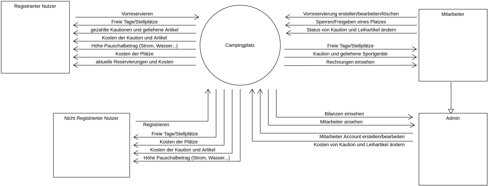

=== Top-Level-Architektur

[[TopLevel]]
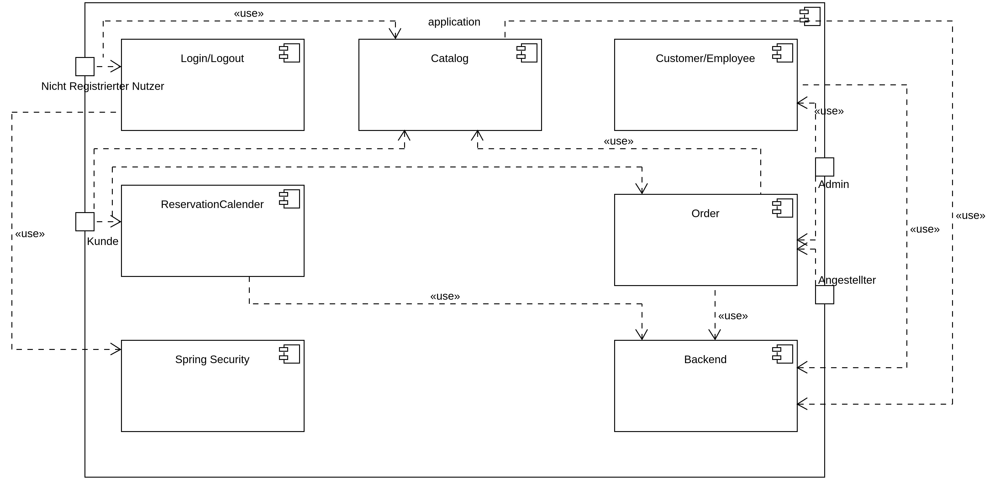

== Anwendungsfälle

[[use_case_diagram]]
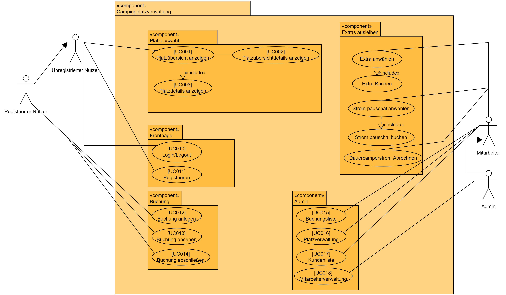

[[Akteure]]
=== Akteure

// See http://asciidoctor.org/docs/user-manual/#tables
[options="header"]
[cols="1,4"]
|===
|Name |Beschreibung
|Nutzer  |Repräsentiert jede Person die mit dem System interagiert, egal ob authentifiziert oder nicht
|Registrierter/ Authentifizierter Nutzer     |Jede Person die mit dem System interagiert, einen Account hat und damit authentifiziert ist
|Unauthentifizierter Nutzer                  |Personen die mit dem System interagieren, ohne authentifiziert zu sein
|Admin                                        |Jeder registrierte und authentifizierte Nutzer mit der Rolle "Admin". Ist für die Administration verantwortlich
|Mitarbeiter |Jeder registrierte und authentifizierte Nutzer mit der Rolle "Mitarbeiter". Ist für die Verwaltung verantwortlich
|Kunde                                    |Jeder registrierte und authentifizierte Nutzer mit der Rolle "Kunde"
|===

[[Anwendungsfallbeschreibungen]]
=== Anwendungsfallbeschreibungen

[cols="1h, 3"]
[[UC010]]
|===
|ID                         |**<<UC010>>**
|Name                       |Login/Logout
|Beschreibung                |Ein Nutzer soll sich im System anmelden (authentifizieren) können um weitere Funktionen zu erhalten. Dieser Prozess ist durch ein Abmelden umkehrbar

|Teilnehmer                     |Nutzer
|Auslöser                    |
_Login_: Nutzer möchte weitere Funktionalitäten durch das Anmelden

_Logout_: Nutzer möchte die Seite verlassen
|Vorbedingungen           a|
_Login_: Nutzer ist nocht nicht authentifiziert

_Logout_: Nutzer ist authentifiziert
|Notwendige Schritte          a|
_Login_:

  1. Nutzer klickt auf "Login"
  2. Nutzer gibt seine Daten ein
  3. Nutzer klickt auf "Login"

_Logout_:

  1. Nutzer klickt auf "Logout"
  2. Nutzer ist deauthentifiziert und kommt zurück auf die Startseite

|Funktionale Anforderungen    |<<F001>>
|===

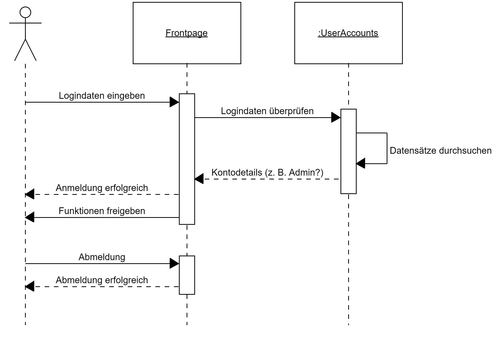

[cols="1h, 3"]
[[UC011]]
|===
|ID                         |**<<UC011>>**
|Name                       |Registrieren
|Beschreibung                |Ein nicht authentifizierten Nutzer soll in der Lage sein einen Account für sich zu erstellen
|Teilnehmer                  |Nicht authentifizierter Nutzer
|Auslöser                    |Nicht authentifizierter Nutzer möchte einen Account für sich erstellen indem er auf "Registrieren" klickt
|Vorbedingungen           a|    Teilnehmer ist bisher nicht angemeldet (authentifiziert)
|Notwendige Schritte          a|1.  Nicht authentifizierter Nuter klickt auf "Registrieren"
2.  Er gibt den gewünschten Nutzername, passwort und Adresse ein
3. Das System überprüft die Daten auf Einzigartigkeit
    . Wenn die Daten einzigartig sind wird ein Account mit diesen erstellt
    . Alternativ wird eine Fehlermeldung angezeigt

|Funktionale Anforderungen    |<<F002>>
|===

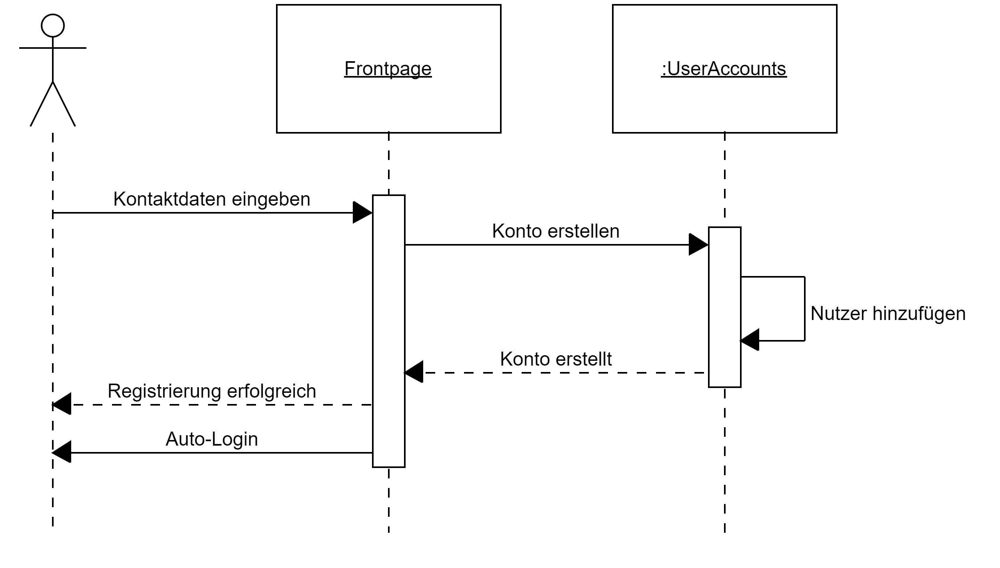

[cols="1h, 3"]
[[UC001]]
|===
|ID                         |**<<UC001>>**
|Name                       |Platzübersicht anzeigen
|Beschreibung                |Ein Besucher der Campingplatzseite soll eine Übersicht über die vorhandenen Plätze und ihre Belegung bekommen
|Teilnehmer                  |Nutzer
|Auslöser                    |Nutzer klickt auf "Platzübersicht"
|Vorbedingungen           a|    keine
|Notwendige Schritte          a|Nutzer muss die Webseite aufrufen

|Funktionale Anforderungen    |<<F004>>
|===

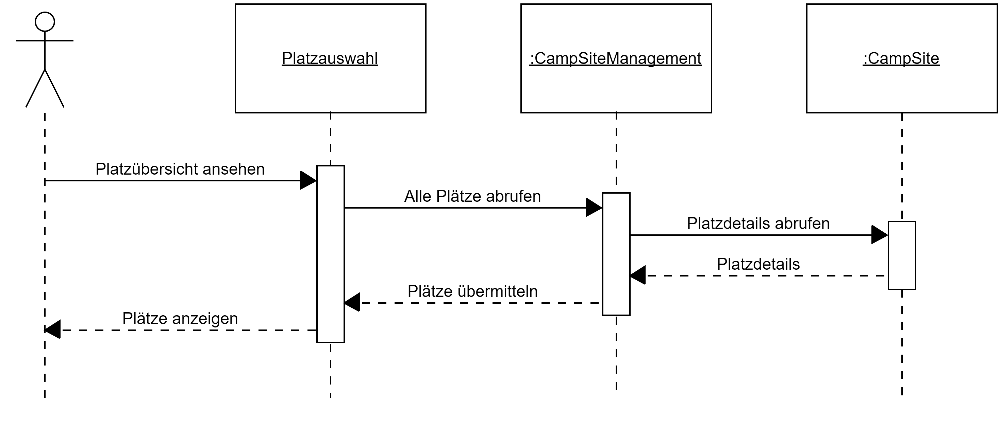

[cols="1h, 3"]
[[UC012]]
|===
|ID                         |**<<UC012>>**
|Name                       |Reservierung anlegen
|Beschreibung                |Ein Nutzer soll einen Platz reservieren können
|Teilnehmer                  |Nutzer
|Auslöser                    |Authentifizierter Nutzer möchte einen Platz reservieren
|Vorbedingungen           a|    Der Nutzer ist angemeldet
|Notwendige Schritte          a|1.  Der Nutzer wählt die Platzübersicht aus
2.  Der Nutzer wählt einen verfügbaren Platz aus
3. Der Nutzer klickt auf "Reservieren"
4.  Nach Eingabe aller Daten sollte er eine Bestätigung erhalten

|Funktionale Anforderungen    |<<F004>>
|===

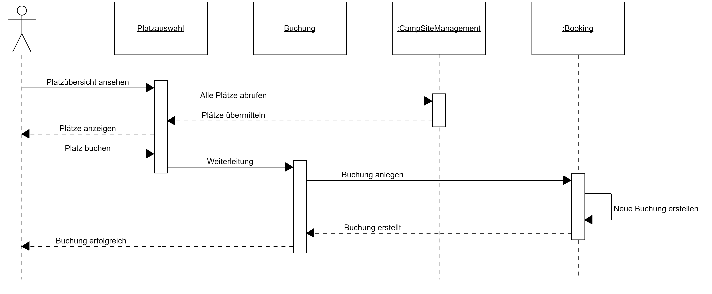

[cols="1h, 3"]
[[UC003]]
|===
|ID                         |**<<UC003>>**
|Name                       |Platzdetails anzeigen
|Beschreibung                |Ein Nutzer soll eine genauere Übersicht über die Eigenschaften eines Platzes bekommen können
|Teilnehmer                  |Nutzer
|Auslöser                    |Nutzer klickt auf den Platz in der Übersicht
|Vorbedingungen           a|    Nutzer ist in der Platzübersicht
|Notwendige Schritte          a|1.  Nutzer klickt auf einen Platz
2.  Die weiteren Eigenschaften des Platzes werden angezeigt

|Funktionale Anforderungen    |<<F003>> <<F006>> 
|===

[cols="1h,3"]
[[UC19]]
|===
|ID                         |**<<UC19>>**
|Name                       |Platz als defekt markieren
|Beschreibung                |Ein Mitarbeiter soll einen Platz als defekt markieren können

|Beteiligt                     |Mitarbeiter
|Auslöser                    |Mitarbeiter klickt in der Platzübersicht auf "Defekt" und beschreibt den Defekt kurz
|Vorbedingung          |Nutzer ist authentifiziert und hat die Rolle "Mitarbeiter".
Nutzer ist in der Platzverwaltung
|Notwendige Schritte    a|
1.  Mitarbeiter klickt auf einen Platz
2.  Mitarbeiter klickt auf "Defekt" und gibt eine kurze Beschreibung an

|Funktionale Anforderungen   | <<F009>>
|===

[cols="1h,3"]
[[UC20]]
|===
|ID                         |**<<UC20>>**
|Name                       |Verliehene Artikel einsehen
|Beschreibung                |Ein Mitarbeiter sollte die ausgeliehenden Leihgegenstände einsehen können.

|Beteiligt                     |Mitarbeiter
|Auslöser                    |Mitarbeiter klickt auf Fläche Leihgegenstände
|Vorbedingung          |Nutzer ist authentifiziert und hat die Rolle "Mitarbeiter"
|Notwendige Schritte    a|
1.  Mitarbeiter klickt auf "Leihgegenstände".                           
2.  Es wird eine Liste mit Leihgegenständen angezeigt.
|Funktionale Anforderungen   | <<F011>>
|===

[cols="1h,3"]
[[UC015]]
|===
|ID                         |**<<UC015>>**
|Name                       |Buchungen einsehen
|Beschreibung                |Ein Mitarbeiter sollte die vorliegenden Buchungen einsehen können.

|Beteiligt                     |Mitarbeiter
|Auslöser                    |Mitarbeiter klickt auf Fläche "Buchungsliste"
|Vorbedingung          |Nutzer ist authentifiziert und hat die Rolle "Mitarbeiter"
|Notwendige Schritte    a|
1.  Mitarbeiter klickt auf "Buchungsliste".                           
2.  Es wird eine Liste mit Buchungen angezeigt.
|Funktionale Anforderungen   | <<F005>>
|===

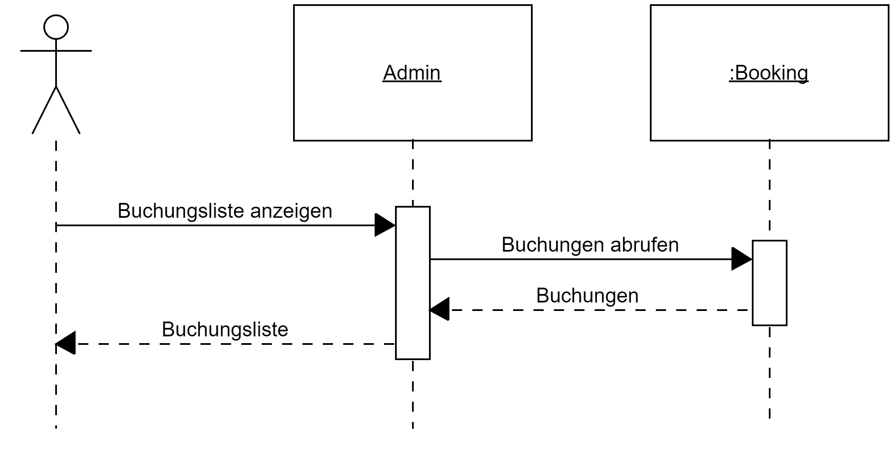

[[Funktionale]]

=== Funktionale Anforderungen

=== Muss-Kriterien

[options="header", cols="2h, 1, 3, 12"]
|===
|ID
|Version
|Name
|Beschreibung

|[[F001]]<<F001>>
|v0.1
|Anmeldung
a|
Das System verfügt über drei verschieden Benutzer: Kunde, Mitarbeiter und Admin.
Diese können sich mit E-Mail und Passwort anmelden. 

|[[F002]]<<F002>>
|v0.1
|Registrierung
a|
Der Administrator Account wird von den Entwicklern erstellt. Die Mitarbeiter-Accounts werden vom Administrator erstellt und verwaltet. Die Kunden können sich über das Onlineportal anmelden. Anmeldedaten die dabei abgefragt werden sind folgende: +

* Name, Vorname +
* Geburtstag +
* vollständige Adresse +
* Email-Adresse 

|[[F003]]<<F003>>
|v0.1
|Verwaltung von Zelt- bzw. Lagerplätzen
a|
Der Admin und die Mitarbeiter können Plätze erstellen, bearbeiten, löschen und den aktuellen Status des Platzes ändern. Es existieren verschiedene größen von Plätzen mit und ohne Parkplatz für verschiedene Fahrzeuge. Folgende Kombinationen werden implementiert: 

* Kleiner Zelt-, Lagerplatz + Stellplatz für Auto + 
* Kleiner Zelt-, Lagerplatz + Stellplatz für Motorrad +
* Kleiner Zelt-, Lagerplatz + Stellplatz für Campingwagen +
* Kleiner Zelt-, Lagerplatz + kein Stellplatz +

* Mittlerer Zelt-, Lagerplatz + Stellplatz für Auto +
* Mittlerer Zelt-, Lagerplatz + Stellplatz für Motorrad +
* Mittlerer Zelt-, Lagerplatz + Stellplatz für Campingwagen +
* Mittlerer Zelt-, Lagerplatz + kein Stellplatz + 

* Großer Zelt-, Lagerplatz + Stellplatz für Auto +
* Großer Zelt-, Lagerplatz + Stellplatz für Motorrad +
* Großer Zelt-, Lagerplatz + Stellplatz für Campingwagen +
* Großer Zelt-, Lagerplatz + kein Stellplatz +

|[[F004]]<<F004>> 
|v0.1
|Reservierung
a|
Kunden bekommen eine Übersicht der verfügbaren Plätze angezeigt (bei einem Klick darauf auch die Details), 
die sie online reservieren können. Alternativ kann der Kunde telefonisch vorreservieren und ein Mitarbeiter fügt diese Reservierung durch. 

|[[F005]]<<F005>>
|v0.1
|Buchung
a|

Ein Mitarbeiter fügt eine konkrete Buchung durch, wenn der Kunde am Campingplatz angekommen ist. Andere Familienmitglieder werden hier ins System eingetragen. 

|[[F006]]<<F006>>
|v0.1
|Platzvorschläge
a|

Wenn Kunden oder Mitarbeiter nach Plätzen suchen und kein passender verfügbar ist, wird das System alternativen vorschlagen. 
Die vorgeschlagenen Plätze werden einmal die gleiche Größe haben wie der ursprümglich gesuchte und einmal die gleiche Stellplatzgröße.

|[[F007]]<<F007>>
|v0.1
|Gruppen
a|
Wenn eine Gruppe mehrere Plätze buchen, wird dies vom System berücksichtigt und ein Rabatt gewährt. Jede Familie in der Gruppe bekommt eine eigene Rechnung gestellt, auf die der Rabatt zugerechnet wird. 

|[[F008]]<<F008>>
|v0.1
|Dauercamper
a|
Die Dauercampingplätze können von April bis Oktober angemietet werden. Eine Rechtzeitige Anmeldung der Dauercamper ist hierfür vorgesehen. Am Ende eines Jahres werden die Dauercamper automatisch für das nächste Jahr auf dem gleichen Stellplatz Vorreserviert, diese Vorreservierung müssen sie bis zu einem bestimmten Zeitraum bestätigen, sonst wird die Vorreservierung aufgehoben und der Dauercampingplatz kann wieder frei Reserveriert werden. 

|[[F009]]<<F009>>
|v0.1
|Status der Plätze
a|
Die Campingplätze haben verschiedene Status, die zum Teil von den Mitarbeitern gesetzt werden können. Folgende Status sind vorgeplant: +
* frei +
* belegt + 
* defekt +

|[[F010]]<<F010>>
|v0.1
|Rechnung
a|

Jeder Kunde bekommt am Ende seiner Buchungszeit eine Rechnung ausgestellt, auf der alle Kosten aufgelistet sind. Die Kosten werden automatisch vom System zusammengerechnet. Strom- und Wasserkosten werden täglich pauschal abgerechnet. + 
Dauercamper haben einen Strom- und Wasserzähler, die abgelesen werden und ins System eingegeben werden. Die Kosten werden dann auf die Rechnung aufgenommen. 

|[[F011]]<<F011>>
|v0.1
|Leihgegenstände
a|
Das System zeigt auf der Website an, welche Gegenstände gemietet werden können. Wenn sich ein Kunde dazu entscheide, dass er gern etwas mieten würde, muss er zu einem Mitarbeiter gehen, dieser wird ihm dann, falls vorhanden, einen Gegenstand aushändigen und im System vermerken, dass dieser Gegenstand bei diesem Kunden ist. Wenn der Kunde den Gegenstand wieder zurückbringt wird die Kaution zurückgezahlt und dies dem System mitgeteilt. Das System rechnet dann automatisch die Kosten dafür aus und setzt sie dem Kunden auf die Rechnung. 

|===

=== Kann-Kriterien

[options="header", cols="2h, 1, 3, 12"]
|===
|ID
|Version
|Name
|Beschreibung

|
|
|Fahrradverleih
a|
Es wird überlegt einen Fahrradverleih anzugliedern

|
|
|Statistische Funktionen für den Administrator
a|
Es wird überlegt einige statistische Übersichten für den Campingplatzbetreiber zur Analysierung der einzelnen Campingplätze zu implementieren. 

|
|
|Interaktive Karte
a|
Es wird überlegt eine interaktive Karte auf der Homepage zu implementieren, auf der sich die Kunden dann leichter auf dem Campingplatz zurechtfinden und weitergeleitet werden können. 
|
|
|Profilseite für Kunden
a|
Vielleicht sollen Kunden auf eine Profilseite zugreifen können, auf der sie ihre Profildaten anpassen können und einen Überblick über aktive und abgeschlossene Buchungen haben.

|
|
|Zwei-Faktor-Authentisierung
a|
Für eine erhöhte Sicherheit ist es möglich eine Zwei-Faktor-Authentisierung bei den Accounts zu aktiviern. 
|
|
|Zwei-Faktor-Authentisierung deaktivieren
a|
Mitarbeiter können die Zwei-Faktor-Authentisierung eines Kunden zurücksetzen 
|
|
|Passwort vergessen
a|
Den Kunden wird ermöglicht selbstständig ein vergessenes Passwort zurückzusetzen
|
|
|Account sperren
a|
Nach zu vielen gescheiterten Login Versuchen wird das System einen Account sperren. Dieser kann von Mitarbeitern wieder freigeschaltet werden oder über die Emailadresse durch den Kunden
|
|
|Captcha bei Registrierung
a|
Zur Erhöhung der Sicherheit muss ein Captcha zum Vervollstädigen des Registrierungsprozesses gelöst werden
|
|
|Nicht zahlenden Kunden erinnern
a|
2 Wochen nach Check-out sollte ein Kunde seine Rechnung noch nicht bezahlt haben, erhält der Kunde automatisch eine E-Mail, welche ihn an die vergessene Zahlung erinnert und diese Zahlung wird in den Buchungen hervorgehoben. Weitere 2 Wochen später erhält der Platzbetreiber eine Nachricht mit den Kunden und Buchungsinformationen.
|
|
|Interaktiver Kalender zum wählen der Plätze
a|
Zur Erhöhung der Useability wurde ein schöner und umgänglicher Kalender eingesetzt werden
|===

[[Nicht-Funktionale]]
== Nicht-Funktionale Anforderungen

=== Qualitätsziele

[options="header"]
[cols="2,1,1,1"]
|===
|Produktqualität | hoch | normal | nicht relevant
|*Funktionalität* |   |   |   
|Angemessenheit   | X |   |  
|Richtigkeit      |   | X |   
|Ordnungsmäßigkeit|   | X |   
|Sicherheit       |   | X |   
|*Benutzbarkeit*  |   |   |   
|Verständlichkeit |   | X |   
|Erlernbarkeit    |   | X |   
|Bedienbarkeit    | X |   |   
|*Effizienz*      |   |   |   
|Zeitverhalten    |   | X |   
|Verbrauchsverhalten  |   | X |
|Bedienbarkeit    | X |   |   
|*Änderbarkeit*   |   |   |   
|Analysierbarkeit | X |   |   
|Modifizierbarkeit|  |   |  X 
|Stabilität       | X |   |   
|Prüfbarkeit      |   |   | X 
|===

=== Konkrete Nicht-Funktionale Anforderungen

1. Änderbarkeit: Einfache Anpassbarkeit durch den Einsatz von Frameworks. 
2. Geringer Ressourcenverbrauch: Muss mehrere Anfragen verschiedener Benutzer gleichzeitig verwalten können. 
3. Sicherheit: Muss Datensicher, Funktionalesicher, Angriffssicher sein. 
4. Zeitverhalten: System muss in kurzer Zeit auf Anfragen antworten.
5. Übertragbarkeit: Soll auf Bildschirmauflösung reagieren und die Seite anpassen.
6. Benutzbarkeit: Soll sich intuitiv und einfach bedienen lassen.

[[GUI]] 

== GUI Prototyp

[[home_image]]
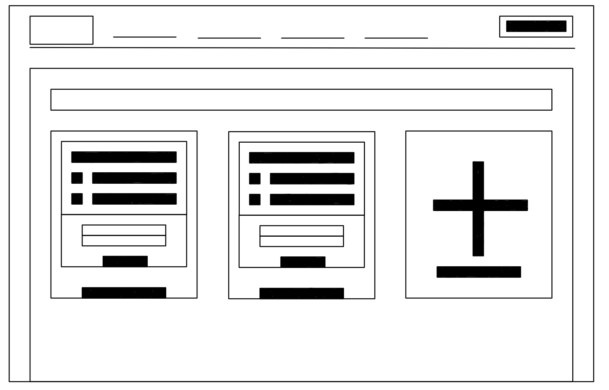

[[home_image]]
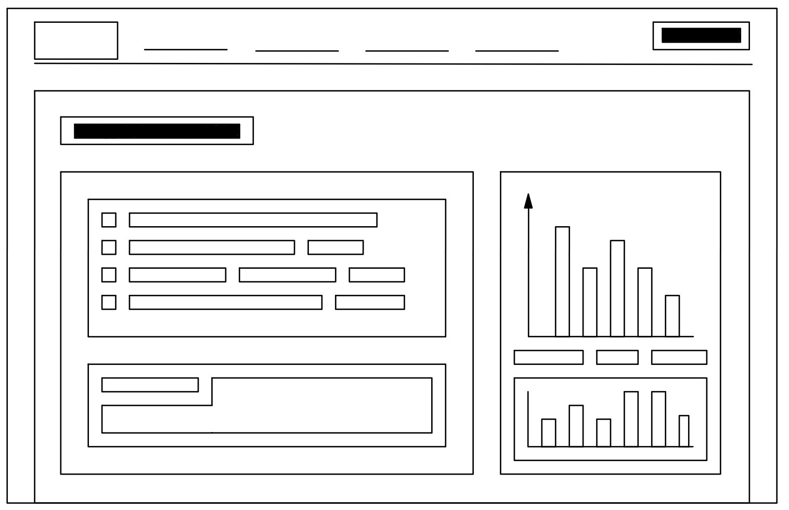

[[home_image]]
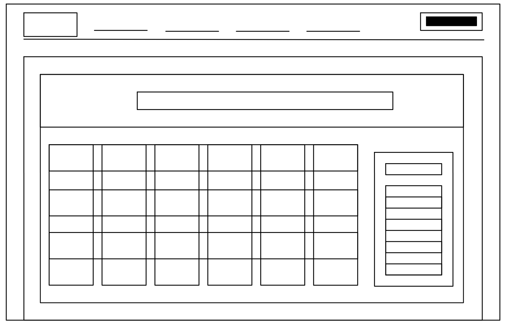

== Datenmodell

=== Überblick: Klassendiagramm
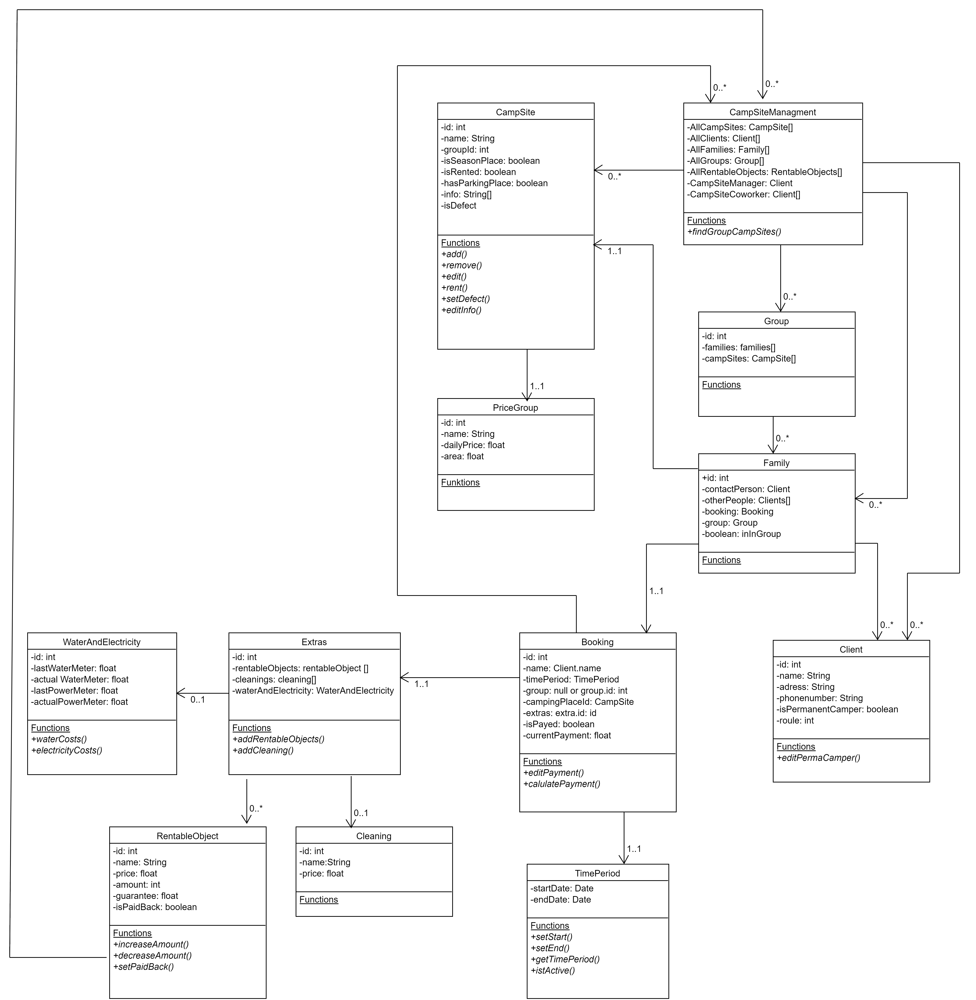

[[Akzeptanztestfälle]]
== Akzeptanztestfälle

[cols="1h,4"]
[[AT001]]
|===
|ID                  |<<AT001>>
|Use Case            |<<UC010>>
|Vorbedingung        |Das System hat registrierte Nutzer
|Ereignis           |Es werden Daten in den Login eingegeben, welche zu keinem Nutzer gehören und auf Login geklickt
|Erwartetes Ergebnis |Es wird ein Hinweis angezeigt, dass die Daten nicht korrekt sind.
|===

[cols="1h,4"]
[[AT002]]
|===
|ID                  |<<AT002>>
|Use Case| <<UC010>>   
|Vorbedingung       |Das System hat registrierte Nutzer
|Ereignis         |Es werden Daten in den Login eingegeben, welche zu einem Nutzer gehören und  "Login" geklickt
|Erwartetes Ergebnis a|- Der Nutzer ist angemeldet 
- Der Nutzer hat Zugriff auf alle Funktionen, die die Zugriffsrechte "Nutzer" benötigen
|===

[cols="1h,4"]
[[AT003]]
|===
|ID                  |<<AT003>>
|Use Case| <<UC010>>   
|Vorbedingung       |Ein Nutzer ist im System angemeldet
|Ereignis         |Der Nutzer klickt auf den Knopf „Logout“
|Erwartetes Ergebnis a|- Der Nutzer ist nicht weiter angemeldet 
- Der Nutzer verliert Zugriff auf alle Funktionen für die die Zugriffsrechte "Nutzer" benötigt werden
|===

[cols="1h,4"]
[[AT004]]
|===
|ID                  |<<AT004>>
|Use Case| <<UC011>>   
|Vorbedingung       |Ein nicht angemeldeter Nutzer nutzt das System
|Ereignis       a|Der Nutzer klickt „Registrieren“ und gibt folgende Informationen ein:
 
- Name: Test 
- Passwort: Test123 
- Email: Test@Test.de 

Der Nutzer klickt auf „Registrieren“ 
|Erwartetes Ergebnis a|- Es wird ein neuer Nutzer mit diesen Daten erzeugt 
-  Es ist möglich sich mit diesen Daten anzumelden 
-  Der Nutzer wird nicht automatisch angemeldet sondern   auf die Startseite weitergeleitet
|===

[cols="1h,4"]
[[AT005]]
|===
|ID                  |<<AT005>>
|Use Case| <<UCUC016>>   
|Vorbedingung       |Nutzer ist als "Mitarbeiter" authentifiziert
|Ereignis         |Der Nutzer markiert einen Platz in der Platzverwaltung als defekt
|Erwartetes Ergebnis |Der Platz ist nicht mehr buchbar
|===

[cols="1h,4"]
[[AT006]]
|===
|ID                  |<<AT006>>
|Use Case| <<UC012>>  
|Vorbedingung       |Nutzer ist als "Kunde" authentifiziert
|Ereignis         |Der Nutzer wählt einen Platz aus und klickt auf Einkaufswagen und abschließend auf reservieren
|Erwartetes Ergebnis a|- Der Platz ist nicht mehr reservierbar
 - Die Daten des Nutzers ercheinen in der Buchungsliste
|===

[cols="1h,4"]
[[AT007]]
|===
|ID                  |<<AT007>>
|Use Case| -  
|Vorbedingung       |Nutzer ist als Mitarbeiter authentifiziert
|Ereignis         |Der Nutzer wählt einen Kunden aus und fügt Leihgegenstände hinzu
|Erwartetes Ergebnis |Das Extra wird, mit einem Leihdatum und den Kosten pro Zeiteinheit dem Kunden hinzugefügt
|===

[cols="1h,4"]
[[AT008]]
|===
|ID                  |<<AT008>>
|Use Case| -  
|Vorbedingung       |Nutzer ist als Mitarbeiter authentifiziert
|Ereignis         |Der Nutzer wählt einen Kunden aus und zahlt die Kaution zurück
|Erwartetes Ergebnis |Die Kosten für das Leihen werden, abhängig von der Leihdauer, der Rechnung des Kunden hinzugefügt
|===

[cols="1h,4"]
[[AT009]]
|===
|ID                  |<<AT009>>
|Use Case| -  
|Vorbedingung       |Nutzer ist als Mitarbeiter authentifiziert
|Ereignis         |Der Nutzer wählt einen Platz aus und markiert diesen als "Defekt"
|Erwartetes Ergebnis |Der Platz ist in der Platzübersicht nicht mehr buchbar
|===

[cols="1h,4"]
[[AT010]]
|===
|ID                  |<<AT010>>
|Use Case| -  
|Vorbedingung       |Nutzer ist als Kunde authentifiziert
|Ereignis         |Der Nutzer versucht einen, als defekt markierten Platz zu buchen
|Erwartetes Ergebnis a|-  Die Schaltfläche "Buchen" ist nicht klickbar 
- Der Platz kann nicht gebucht werden
|===

[cols="1h,4"]
[[AT010]]
|===
|ID                  |<<AT011>>
|Use Case| <<UC018>>  
|Vorbedingung       |Nutzer ist als Admin authentifiziert
|Ereignis         |Der Nutzer versucht einen Mitarbeiter zu erstellen
|Erwartetes Ergebnis a|-  Es kann sich mit den eingegebenen Daten angemeldet werden 
- Es können alle Funktionen genutzt werden, für die die Rolle "Mitarbeiter" notwendig ist
|===

[[Glossar]]
== Glossar
Sämtliche Begriffe, die innerhalb des Projektes verwendet werden und deren gemeinsames Verständnis aller beteiligten Stakeholder essentiell ist, sollten hier aufgeführt werden.
Insbesondere Begriffe der zu implementierenden Domäne wurden bereits beschrieben, jedoch gibt es meist mehr Begriffe, die einer Beschreibung bedürfen. +

[options="header", cols="1h, 4"]
|===
|Begriff                  |Beschreibung
|Administrator          | Meint einen Benutzer mit erweiterten Rechten im System
|Login                  | Erfolgreiche Authentifizierung nachdem korrekte, also existierende, Nutzerdaten eingegeben wurden 
|Logout                  | Ausloggen aus dem System
|Registrierung  | Der Prozess der Erstellung eines neuen Accounts im System
|Rolle              | Eine Rolle wird eingesetzt um authentifizierten Nutzern verschiedene Rechte im System zu geben. Je nach Rolle sind verschiedene Funktionalitäten im System verfügbar
|System                 | Ein Ausdruck für die Anwendung die während des Projekts implementiert werden soll
|Nutzer                   | Eine representation einer realen Person im System. Diese Representation wird nur erstellt, wenn der Nutzer sich im System regestriert und genutzt, wenn diese sich authentifiziert.
|===
